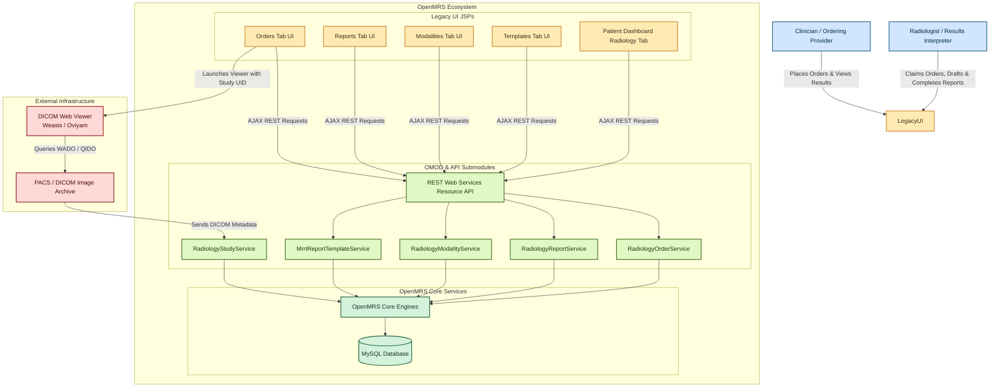
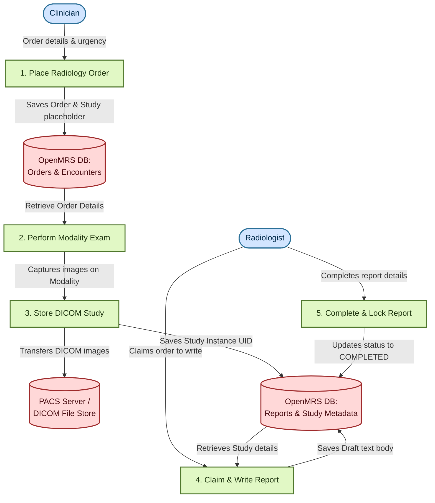
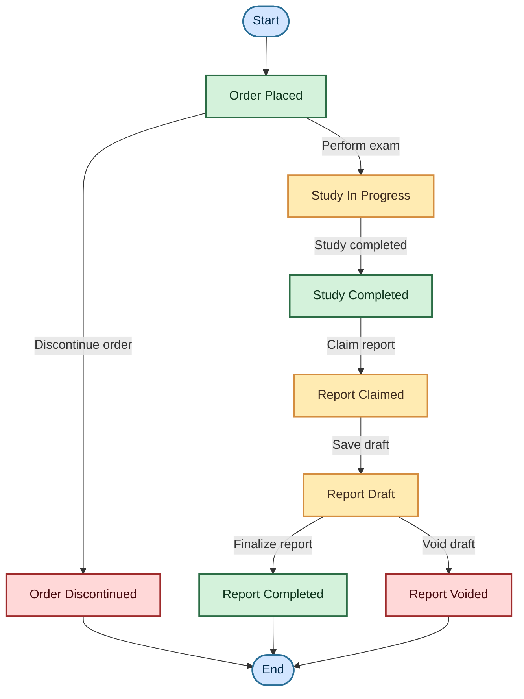
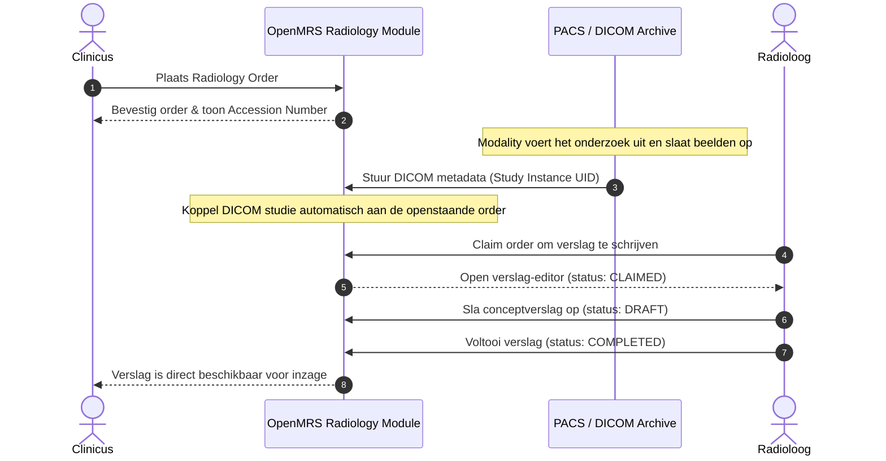

# Radiology Module Functional Map

This document provides a structured map of the active functionalities, Java services, REST API endpoints, and legacy user interface screens within the OpenMRS Radiology Module.

---

## Table of Contents
* [System Diagrams & Workflows](#system-diagrams--workflows)
* [1. Backend Services (API Module)](#1-backend-services-api-module)
* [2. REST API Endpoints (OMOD Module)](#2-rest-api-endpoints-omod-module)
* [3. Legacy UI Screens (OMOD Module)](#3-legacy-ui-screens-omod-module)
* [4. Extensions & Portlets](#4-extensions--portlets)

---

## System Diagrams & Workflows

To help visualize how the different modules, services, and external interfaces interact, the following diagrams illustrate the architecture, data flows, and state lifecycles within the Radiology Module.

### A. C4 System Container Diagram
Dit diagram toont de structuur van de module: de rollen (blauw), de schermen (geel), de backend-services (groen), de OpenMRS core (mint) en externe systemen (rood).

### B. Data Flow Diagram (DFD Level 1)
Dit diagram laat zien hoe data stroomt tussen gebruikers (blauw), processen (groen) en databases/systemen (rood) bij het bestellen van onderzoeken en schrijven van verslagen.

### C. Order & Report Lifecycle (State Path Diagram)
Dit diagram toont de stappen die een order en rapport doorlopen, van aanvraag tot afronding (groen) of annulering/verwijdering (rood).

### D. Order-to-Report Volgordediagram (Sequence Diagram)
Dit diagram toont de chronologische stappen en interacties tussen de verschillende actoren en systemen, van het plaatsen van de radiology order tot het afronden van het verslag.

## 1. Backend Services (API Module)

### RadiologyStudyService
* **Interface**: [`RadiologyStudyService.java`](file:///c:/Github/openmrs-module-radiology/api/src/main/java/org/openmrs/module/radiology/study/RadiologyStudyService.java)
* **Implementation**: [`RadiologyStudyServiceImpl.java`](file:///c:/Github/openmrs-module-radiology/api/src/main/java/org/openmrs/module/radiology/study/RadiologyStudyServiceImpl.java)
* **Functions**:
  * `saveRadiologyStudy(RadiologyStudy study)`: Saves a new radiology study record.
    * *Required Privilege*: `Add Radiology Studies`
  * `getRadiologyStudy(Integer studyId)`: Retrieves a radiology study by its database ID.
    * *Required Privilege*: `Get Radiology Studies`
  * `getRadiologyStudyByUuid(String uuid)`: Retrieves a radiology study by its UUID.
    * *Required Privilege*: `Get Radiology Studies`
  * `getRadiologyStudyByStudyInstanceUid(String studyInstanceUid)`: Retrieves a radiology study matching a specific Study Instance UID.
    * *Required Privilege*: `Get Radiology Studies`

### RadiologyOrderService
* **Interface**: [`RadiologyOrderService.java`](file:///c:/Github/openmrs-module-radiology/api/src/main/java/org/openmrs/module/radiology/order/RadiologyOrderService.java)
* **Implementation**: [`RadiologyOrderServiceImpl.java`](file:///c:/Github/openmrs-module-radiology/api/src/main/java/org/openmrs/module/radiology/order/RadiologyOrderServiceImpl.java)
* **Functions**:
  * `placeRadiologyOrder(RadiologyOrder order)`: Places a new `RadiologyOrder` and its linked `RadiologyStudy`, creates a radiology order encounter, and assigns a unique accession number.
    * *Required Privilege*: `Add Radiology Orders`
  * `discontinueRadiologyOrder(RadiologyOrder order, Provider orderer, String reason)`: Discontinues an existing order by creating a discontinuation order. Fails if the order is already in progress or completed.
    * *Required Privilege*: `Delete Radiology Orders`
  * `getRadiologyOrder(Integer orderId)`: Retrieves a radiology order by its database ID.
    * *Required Privilege*: `Get Radiology Orders`
  * `getRadiologyOrderByUuid(String uuid)`: Retrieves a radiology order by its UUID.
    * *Required Privilege*: `Get Radiology Orders`
  * `getRadiologyOrders(RadiologyOrderSearchCriteria criteria)`: Queries and retrieves a list of radiology orders matching search criteria (e.g. Patient, Accession Number, Urgency, date range).
    * *Required Privilege*: `Get Radiology Orders`
  * `getNextAccessionNumberSeedSequenceValue()`: Returns the next sequence seed for generating accession numbers.

### RadiologyModalityService
* **Interface**: [`RadiologyModalityService.java`](file:///c:/Github/openmrs-module-radiology/api/src/main/java/org/openmrs/module/radiology/modality/RadiologyModalityService.java)
* **Implementation**: [`RadiologyModalityServiceImpl.java`](file:///c:/Github/openmrs-module-radiology/api/src/main/java/org/openmrs/module/radiology/modality/RadiologyModalityServiceImpl.java)
* **Functions**:
  * `saveRadiologyModality(RadiologyModality modality)`: Saves a new or updates an existing `RadiologyModality` (e.g. CT, MR, XR).
    * *Required Privilege*: `Manage Radiology Modalities`
  * `retireRadiologyModality(RadiologyModality modality, String reason)`: Retires a modality, removing it from active selection.
    * *Required Privilege*: `Manage Radiology Modalities`
  * `getRadiologyModality(Integer id)`: Retrieves a modality by its database ID.
    * *Required Privilege*: `Get Radiology Modalities`
  * `getRadiologyModalityByUuid(String uuid)`: Retrieves a modality by its UUID.
    * *Required Privilege*: `Get Radiology Modalities`
  * `getRadiologyModalities(boolean includeRetired)`: Retrieves a list of modalities, optionally including retired ones.
    * *Required Privilege*: `Get Radiology Modalities`

### RadiologyReportService
* **Interface**: [`RadiologyReportService.java`](file:///c:/Github/openmrs-module-radiology/api/src/main/java/org/openmrs/module/radiology/report/RadiologyReportService.java)
* **Implementation**: [`RadiologyReportServiceImpl.java`](file:///c:/Github/openmrs-module-radiology/api/src/main/java/org/openmrs/module/radiology/report/RadiologyReportServiceImpl.java)
* **Functions**:
  * `createRadiologyReport(RadiologyOrder order)`: Creates a new report linked to a completed order and sets its initial status to `CLAIMED`.
    * *Required Privilege*: `Add Radiology Reports`
  * `saveRadiologyReportDraft(RadiologyReport report)`: Saves/updates a report in `DRAFT` status.
    * *Required Privilege*: `Edit Radiology Reports`
  * `saveRadiologyReport(RadiologyReport report)`: Completes a report, setting its status to `COMPLETED` and recording the completion date.
    * *Required Privilege*: `Edit Radiology Reports`
  * `voidRadiologyReport(RadiologyReport report, String voidReason)`: Voids a report with a specified reason. Fails if the report is already completed.
    * *Required Privilege*: `Delete Radiology Reports`
  * `getRadiologyReport(Integer reportId)`: Retrieves a report by database ID.
    * *Required Privilege*: `Get Radiology Reports`
  * `getRadiologyReportByUuid(String uuid)`: Retrieves a report by UUID.
    * *Required Privilege*: `Get Radiology Reports`
  * `getRadiologyReports(RadiologyReportSearchCriteria criteria)`: Retrieves reports matching search criteria (dates, interpreter, status, include voided).
    * *Required Privilege*: `Get Radiology Reports`
  * `getActiveRadiologyReportByRadiologyOrder(RadiologyOrder order)`: Retrieves the active report (non-voided draft or completed) associated with an order.
    * *Required Privilege*: `Get Radiology Reports`
  * `hasRadiologyOrderClaimedRadiologyReport(RadiologyOrder order)`: Checks if a report is claimed but not yet completed.
    * *Required Privilege*: `Get Radiology Reports`
  * `hasRadiologyOrderCompletedRadiologyReport(RadiologyOrder order)`: Checks if a report has been completed.
    * *Required Privilege*: `Get Radiology Reports`

### MrrtReportTemplateService
* **Interface**: [`MrrtReportTemplateService.java`](file:///c:/Github/openmrs-module-radiology/api/src/main/java/org/openmrs/module/radiology/report/template/MrrtReportTemplateService.java)
* **Implementation**: [`MrrtReportTemplateServiceImpl.java`](file:///c:/Github/openmrs-module-radiology/api/src/main/java/org/openmrs/module/radiology/report/template/MrrtReportTemplateServiceImpl.java)
* **Functions**:
  * `saveMrrtReportTemplate(MrrtReportTemplate template)`: Saves template metadata (Dublin Core properties).
    * *Required Privilege*: `Add Radiology Report Templates`
  * `importMrrtReportTemplate(String mrrtTemplate)`: Parses a template file, saves metadata to database, resolves RadLex reference terms, and writes HTML template content to the filesystem.
    * *Required Privilege*: `Add Radiology Report Templates`
  * `purgeMrrtReportTemplate(MrrtReportTemplate template)`: Deletes template metadata from database and deletes the template file from the filesystem.
    * *Required Privilege*: `Delete Radiology Report Templates`
  * `getMrrtReportTemplate(Integer id)`: Retrieves template by database ID.
    * *Required Privilege*: `Get Radiology Report Templates`
  * `getMrrtReportTemplateByUuid(String uuid)`: Retrieves template by UUID.
    * *Required Privilege*: `Get Radiology Report Templates`
  * `getMrrtReportTemplateByIdentifier(String identifier)`: Retrieves template by Dublin Core identifier.
    * *Required Privilege*: `Get Radiology Report Templates`
  * `getMrrtReportTemplates(MrrtReportTemplateSearchCriteria criteria)`: Search templates by title, creator, publisher, license.
    * *Required Privilege*: `Get Radiology Report Templates`
  * `getMrrtReportTemplateHtmlBody(MrrtReportTemplate template)`: Reads and returns the template HTML body content from the filesystem.
    * *Required Privilege*: `View Radiology Report Templates`

---

## 2. REST API Endpoints (OMOD Module)

REST controllers are registered under the central radiology REST namespace (`/rest/v1/radiology`) via [`RadiologyRestController.java`](file:///c:/Github/openmrs-module-radiology/omod/src/main/java/org/openmrs/module/radiology/web/RadiologyRestController.java).

### Radiology Report Resource
* **Resource Class**: [`RadiologyReportResource.java`](file:///c:/Github/openmrs-module-radiology/omod/src/main/java/org/openmrs/module/radiology/report/web/resource/RadiologyReportResource.java)
* **Search Handler**: [`RadiologyReportSearchHandler.java`](file:///c:/Github/openmrs-module-radiology/omod/src/main/java/org/openmrs/module/radiology/report/web/search/RadiologyReportSearchHandler.java)
* **API Endpoints**:
  * `GET /rest/v1/radiology/radiologyreport/{uuid}`: Retrieves a report.
  * `GET /rest/v1/radiology/radiologyreport`: Searches reports.
    * *Query Params*:
      * `patient` (UUID of patient)
      * `fromdate` (Format: YYYY-MM-DD)
      * `todate` (Format: YYYY-MM-DD)
      * `principalResultsInterpreter` (UUID of provider)
      * `status` (`DRAFT`, `CLAIMED`, `COMPLETED`)
      * `includeAll` (`true`/`false` to include voided reports)
      * `totalCount` (`true`/`false` to include total count in paging)
* *Note: Writes/modifications (POST, DELETE, PURGE) are not supported via the REST resource.*

### MRRT Report Template Resource
* **Resource Class**: [`MrrtReportTemplateResource.java`](file:///c:/Github/openmrs-module-radiology/omod/src/main/java/org/openmrs/module/radiology/report/template/web/resource/MrrtReportTemplateResource.java)
* **Search Handler**: [`MrrtReportTemplateSearchHandler.java`](file:///c:/Github/openmrs-module-radiology/omod/src/main/java/org/openmrs/module/radiology/report/template/web/search/MrrtReportTemplateSearchHandler.java)
* **API Endpoints**:
  * `GET /rest/v1/radiology/mrrtreporttemplate/{uuid}`: Retrieves template metadata.
  * `GET /rest/v1/radiology/mrrtreporttemplate`: Searches templates.
    * *Query Params*:
      * `title` (Filter by dcTermsTitle)
      * `publisher` (Filter by dcTermsPublisher)
      * `license` (Filter by dcTermsLicense)
      * `creator` (Filter by dcTermsCreator)
      * `totalCount` (`true`/`false`)
* *Note: Writes/modifications are not supported via the REST resource.*

### Radiology Order Resource
* **Resource Class**: [`RadiologyOrderResource.java`](file:///c:/Github/openmrs-module-radiology/omod/src/main/java/org/openmrs/module/radiology/order/web/resource/RadiologyOrderResource.java)
* **Search Handler**: [`RadiologyOrderSearchHandler.java`](file:///c:/Github/openmrs-module-radiology/omod/src/main/java/org/openmrs/module/radiology/order/web/search/RadiologyOrderSearchHandler.java)
* **API Endpoints**:
  * `GET /rest/v1/radiology/radiologyorder/{uuid}`: Retrieves order details.
  * `GET /rest/v1/radiology/radiologyorder`: Searches radiology orders.
    * *Query Params*:
      * `accessionNumber` (Order accession number)
      * `patient` (UUID of patient)
      * `fromEffectiveStartDate` (Format: YYYY-MM-DDTHH:mm:ss.SSSZ)
      * `toEffectiveStartDate` (Format: YYYY-MM-DDTHH:mm:ss.SSSZ)
      * `urgency` (`ROUTINE`, `STAT`, `ON_SCHEDULED_DATE`)
      * `totalCount` (`true`/`false`)
* *Note: Writes/modifications are not supported via the REST resource.*

### Radiology Modality Resource
* **Resource Class**: [`RadiologyModalityResource.java`](file:///c:/Github/openmrs-module-radiology/omod/src/main/java/org/openmrs/module/radiology/modality/web/resource/RadiologyModalityResource.java)
* **API Endpoints**:
  * `GET /rest/v1/radiology/radiologymodality/{uuid}`: Retrieves modality details.
  * `GET /rest/v1/radiology/radiologymodality`: Gets all modalities.
    * *Query Params*: `includeAll` (`true`/`false` to include retired modalities).
  * `POST /rest/v1/radiology/radiologymodality`: Creates a new modality or updates an existing one.
    * *Required fields*: `aeTitle`, `name`. Optional: `description`.
  * `DELETE /rest/v1/radiology/radiologymodality/{uuid}`: Retires a modality.
    * *Query Params*: `reason` (required reason).

---

## 3. Legacy UI Screens (OMOD Module)

The UI is built using OpenMRS Legacy UI framework, based on Spring controllers and JSP views located in `omod/src/main/webapp/`.

### Radiology Dashboard
The central hub of the module features a tabbed interface mapped via the dashboard header [`dashboardHeader.jsp`](file:///c:/Github/openmrs-module-radiology/omod/src/main/webapp/dashboardHeader.jsp):

1. **Orders Tab**
   * *Controller*: [`RadiologyDashboardOrdersTabController.java`](file:///c:/Github/openmrs-module-radiology/omod/src/main/java/org/openmrs/module/radiology/order/web/RadiologyDashboardOrdersTabController.java)
   * *URL*: `/module/radiology/radiologyDashboardOrdersTab.htm`
   * *JSP*: [`radiologyDashboardOrdersTab.jsp`](file:///c:/Github/openmrs-module-radiology/omod/src/main/webapp/radiologyDashboardOrdersTab.jsp)
   * *Required Privilege*: `View Orders`
   * *Features*: Lists orders using a DataTable populated via AJAX requests to `/rest/v1/radiologyorder/`. Provides filters for Accession Number, Patient, Start Date Range, and Urgency. Includes a link to place a new order.
2. **Reports Tab**
   * *Controller*: [`RadiologyDashboardReportsTabController.java`](file:///c:/Github/openmrs-module-radiology/omod/src/main/java/org/openmrs/module/radiology/report/web/RadiologyDashboardReportsTabController.java)
   * *URL*: `/module/radiology/radiologyDashboardReportsTab.htm`
   * *JSP*: [`radiologyDashboardReportsTab.jsp`](file:///c:/Github/openmrs-module-radiology/omod/src/main/webapp/radiologyDashboardReportsTab.jsp)
   * *Required Privilege*: `Get Radiology Reports`
   * *Features*: Lists reports using a DataTable populated via AJAX requests to `/rest/v1/radiologyreport/`. Filters by Date Range, Provider, Status, and includes voided reports.
3. **Report Templates Tab**
   * *Controller*: [`RadiologyDashboardReportTemplatesTabController.java`](file:///c:/Github/openmrs-module-radiology/omod/src/main/java/org/openmrs/module/radiology/report/template/web/RadiologyDashboardReportTemplatesTabController.java)
   * *URL*: `/module/radiology/radiologyDashboardReportTemplatesTab.htm`
   * *JSP*: [`radiologyDashboardReportTemplatesTab.jsp`](file:///c:/Github/openmrs-module-radiology/omod/src/main/webapp/radiologyDashboardReportTemplatesTab.jsp)
   * *Required Privilege*: `View Radiology Report Templates`
   * *Features*: Lists MRRT templates. Supports importing templates using a jQuery Dialog popup containing an upload form, and deleting templates (requires `Delete Radiology Report Templates`).
4. **Modalities Tab**
   * *Controller*: [`RadiologyDashboardModalitiesTabController.java`](file:///c:/Github/openmrs-module-radiology/omod/src/main/java/org/openmrs/module/radiology/modality/web/RadiologyDashboardModalitiesTabController.java)
   * *URL*: `/module/radiology/radiologyDashboardModalitiesTab.htm`
   * *JSP*: [`radiologyDashboardModalitiesTab.jsp`](file:///c:/Github/openmrs-module-radiology/omod/src/main/webapp/radiologyDashboardModalitiesTab.jsp)
   * *Required Privilege*: `Get Radiology Modalities`
   * *Features*: Lists modalities with Active/Retired status. Link to add new modalities (requires `Manage Radiology Modalities`).

### Forms and Action Pages

#### Radiology Order Creation Form
* **Controller**: [`RadiologyOrderFormController.java`](file:///c:/Github/openmrs-module-radiology/omod/src/main/java/org/openmrs/module/radiology/order/web/RadiologyOrderFormController.java) (Handles GET and POST `saveRadiologyOrder`)
* **URL**: `/module/radiology/radiologyOrder.form` (with optional `patientId` parameter)
* **JSP**: [`radiologyOrderCreationForm.jsp`](file:///c:/Github/openmrs-module-radiology/omod/src/main/webapp/orders/radiologyOrderCreationForm.jsp)
* **Required Privileges**: `Add Orders`, `Add Radiology Orders`
* **Features**: Form to capture Patient, Imaging Procedure, Order Reason (Coded & Non-Coded), Clinical History, Urgency (ROUTINE, STAT, ON_SCHEDULED_DATE), Performed Status, Instructions, and Orderer. Dynamically toggles the scheduled date input when urgency is set to "On Scheduled Date".

#### Radiology Order Display & Management Form
* **Controller**: [`RadiologyOrderFormController.java`](file:///c:/Github/openmrs-module-radiology/omod/src/main/java/org/openmrs/module/radiology/order/web/RadiologyOrderFormController.java) (Handles GET `orderId` and POST `discontinueOrder`)
* **URL**: `/module/radiology/radiologyOrder.form?orderId={orderId}`
* **JSP**: [`radiologyOrderForm.jsp`](file:///c:/Github/openmrs-module-radiology/omod/src/main/webapp/orders/radiologyOrderForm.jsp)
* **Required Privileges**: `View Orders`
* **Features**: Displays existing order details. Contains three sub-segments based on order state:
  * **Order Display**: Shows metadata (accession, clinical history, referring physician, activated date, status).
  * **DICOM Viewer & Reports**: If the order is completed, shows a link to launch the DICOM study in Weasis/Oviyam and a link to claim/create or view the radiology report.
  * **Order Discontinuation Form**: If the order is eligible for discontinuation, displays a form to discontinue the order with a mandatory reason.

#### Radiology Report Form
* **Controller**: [`RadiologyReportFormController.java`](file:///c:/Github/openmrs-module-radiology/omod/src/main/java/org/openmrs/module/radiology/report/web/RadiologyReportFormController.java)
* **URL**: `/module/radiology/radiologyReport.form` (with `orderId` to claim, or `reportId` to view/edit)
* **JSP**: [`radiologyReportForm.jsp`](file:///c:/Github/openmrs-module-radiology/omod/src/main/webapp/reports/radiologyReportForm.jsp)
* **Required Privileges**: `Add Radiology Reports`, `Edit Radiology Reports`, `Get Radiology Reports`
* **Features**:
  * Integrates **TinyMCE Rich Text Editor** for drafting the report diagnosis.
  * Principal Results Interpreter selector.
  * Toggles inputs between editable (for drafts) and read-only (for completed reports).
  * Provides actions: **Save Draft** (status remains `DRAFT`), **Complete** (sets status to `COMPLETED` and locks editing), and **Void Report** (requires a mandatory reason; only allowed for drafts).

#### MRRT Report Template Preview Page
* **Controller**: [`MrrtReportTemplateFormController.java`](file:///c:/Github/openmrs-module-radiology/omod/src/main/java/org/openmrs/module/radiology/report/template/web/MrrtReportTemplateFormController.java)
* **URL**: `/module/radiology/mrrtReportTemplate.form?templateId={uuid}`
* **JSP**: [`mrrtReportTemplateForm.jsp`](file:///c:/Github/openmrs-module-radiology/omod/src/main/webapp/reports/templates/mrrtReportTemplateForm.jsp)
* **Required Privilege**: `View Radiology Report Templates`
* **Features**: Renders a read-only list of template metadata (title, identifier, creator, publisher, rights, description) along with a grid of resolved concept reference terms (RadLex) and an HTML preview of the template layout.

#### Radiology Modality Form
* **Controller**: [`RadiologyModalityFormController.java`](file:///c:/Github/openmrs-module-radiology/omod/src/main/java/org/openmrs/module/radiology/modality/web/RadiologyModalityFormController.java)
* **URL**: `/module/radiology/radiologyModality.form` (with optional `modalityId` parameter)
* **JSP**: [`radiologyModalityForm.jsp`](file:///c:/Github/openmrs-module-radiology/omod/src/main/webapp/modalities/radiologyModalityForm.jsp)
* **Required Privileges**: `Get Radiology Modalities`, `Manage Radiology Modalities`
* **Features**: Form to create or edit a modality (AE Title, Name, Description). If the modality is already created, displays a form to retire it with a mandatory reason.

---

## 4. Extensions & Portlets

The module extends standard Patient Dashboard tabs and provides reusable portlet fragments.

### Patient Dashboard Tab Portlet
* **Extension Point**: `org.openmrs.patientDashboardTab` (defined in [`config.xml`](file:///c:/Github/openmrs-module-radiology/omod/src/main/resources/config.xml))
* **Class**: [`PatientDashboardRadiologyTabExt.java`](file:///c:/Github/openmrs-module-radiology/omod/src/main/java/org/openmrs/module/radiology/web/extension/html/PatientDashboardRadiologyTabExt.java)
* **JSP Portlet**: [`patientDashboardRadiologyTab.jsp`](file:///c:/Github/openmrs-module-radiology/omod/src/main/webapp/portlets/patientDashboardRadiologyTab.jsp)
* **Required Privilege**: `View Patient Dashboard Radiology Tab`
* **Features**: Displays a dedicated "Radiology" tab inside the patient's dashboard. Shows a DataTable listing all the patient's radiology orders. Includes a link to place a new radiology order prefilled for the patient.

### Radiology Order Details Portlet
* **Controller**: [`RadiologyOrderDetailsPortletController.java`](file:///c:/Github/openmrs-module-radiology/omod/src/main/java/org/openmrs/module/radiology/order/web/RadiologyOrderDetailsPortletController.java)
* **JSP Portlet**: [`radiologyOrderDetails.jsp`](file:///c:/Github/openmrs-module-radiology/omod/src/main/webapp/portlets/radiologyOrderDetails.jsp)
* **Features**: Reusable segment that displays the details of a radiology order (Accession Number, Urgency, Concept/Procedure, Referring Physician, Start Date, etc.) and provides a link to open the DICOM study if completed. Commonly embedded within the report creation page to show the related order context.

